<div align="center">
  
</div>

<h3 align="center">💻 Making .NET Simple | Building Scalable Solutions</h3>

<p align="center">
  <a href="https://linkedin.com/in/awalekiran">
    
  </a>
  <a href="https://instagram.com/carbonfin7">
    
  </a>
  <a href="https://youtube.com/@carbonfin7">
    
  </a>
  <a href="mailto:your.email@example.com">
    
  </a>
</p>

---

### 👨‍💻 About Me

```csharp
/// <summary>
/// Software Developer Profile - Kiran Awale
/// Demonstrates: Clean code, OOP principles, and modern C# features
/// </summary>
public sealed record Developer
{
    public string Name { get; init; } = "Kiran Awale";
    public string Role { get; init; } = "Software Engineer | .NET Specialist";
    public string Location { get; init; } = "India";
    
    public IReadOnlyList<string> TechStack { get; init; } = new[]
    {
        ".NET / C#", "ASP.NET Core", "Azure", "Docker", "Clean Architecture"
    };
    
    public IReadOnlyList<string> CurrentFocus { get; init; } = new[]
    {
        "Building scalable enterprise apps",
        "Creating educational content @carbonfin7",
        "Learning AI integration in .NET"
    };

    /// <summary>
    /// Prints a friendly greeting to visitors
    /// </summary>
    public void SayHello()
    {
        Console.WriteLine($"""
            👋 Hey! I'm {Name}
            💼 {Role}
            📍 {Location}
            
            🚀 Currently: {string.Join(", ", CurrentFocus)}
            🛠️ Tech Stack: {string.Join(" | ", TechStack)}
            
            Thanks for stopping by! Let's build something amazing! 🚀
            """);
    }

    /// <summary>
    /// Returns formatted contact information
    /// </summary>
    public string GetContactInfo() => 
        """
        📫 Let's Connect:
        • LinkedIn: linkedin.com/in/awalekiran
        • Instagram: @carbonfin7
        • YouTube: @carbonfin7
        • Website: kiranawale.dev
        """;
}
```

- 🔭 Currently working on **scalable enterprise applications** and **carbonfin7 content**
- 🌱 Learning **AI/ML integration with .NET** and **cloud-native architectures**
- 💡 Creator of **@carbonfin7** - simplifying .NET for developers worldwide
- 💬 Ask me about **.NET, C#, ASP.NET Core, Azure, Clean Code**
- 📫 Reach me: **[carbonfin7@gmail.com](mailto:carbonfin7@gmail.com)**
- ⚡ Fun fact: I explain code like I'm talking to a friend, not a compiler!

---

### 🛠️ Tech Stack & Tools

<div align="left">
  
### Languages
<p>
  
  
  
  
  
</p>

### Frameworks & Libraries
<p>
  
  
  
  
</p>

### Cloud & DevOps
<p>
  
  
  
  
</p>

### Databases
<p>
  
  
  
  
</p>

### Tools
<p>
  
  
  
</p>

---

### 📊 GitHub Stats

<div align="center">
  
</div>

<div align="center">
  
  
</div>

<div align="center">
  
  
</div>

<div align="center">
  
</div>

---

## 🎨 carbonfin7 - My Content Platform

<div align="center">

**🎯 Mission:** Making .NET simple, one post at a time  
**🔥 Focus:** Real code. Real solutions. Real simple.  
**📚 Topics:** .NET | C# | ASP.NET Core | Azure | Clean Code

</div>

<table align="center">
<tr>
  <td align="center" width="33%">
    <br/>
    <b>Instagram</b><br/>
    <sub>Daily Tips</sub><br/>
    <a href="https://instagram.com/carbonfin7">@carbonfin7</a>
  </td>
  <td align="center" width="33%">
    <br/>
    <b>YouTube</b><br/>
    <sub>Quick Tutorials</sub><br/>
    <a href="https://youtube.com/@carbonfin7">@carbonfin7</a>
  </td>
  <td align="center" width="33%">
    <br/>
    <b>LinkedIn</b><br/>
    <sub>Professional</sub><br/>
    <a href="https://linkedin.com/in/awalekiran">Kiran Awale</a>
  </td>
</tr>
</table>

---

## 📝 Latest Content

<!-- Manually update or use GitHub Actions to auto-update -->

- 📌 [Understanding IOptions Pattern in .NET](https://carbonfin7.dev/ioptions)
- 📌 [Async/Await Best Practices](https://carbonfin7.dev/async-await)
- 📌 [Clean Architecture in ASP.NET Core](https://carbonfin7.dev/clean-arch)

➡️ **[View all posts on carbonfin7.dev](https://carbonfin7.dev)**

---
## 💼 Project Portfolio

<div>

### 🗂️ Organized by Category

---

### 🚀 **Full-Stack Applications**

<div>


</div>

---

### ⚙️ **Backend Services & APIs**

<div>
  
  
</div>

---

### 🎨 **Templates & Boilerplates**

<div>
  
  
</div>

---

### 🤖 **AI & Machine Learning**

<div>
  
  
</div>

</div>

---

<div align="center">

### 🗂️ View More Projects by Category

<p>
  <a href="https://github.com/awalekeeran?tab=repositories&q=&type=&language=csharp&sort=stargazers">
    
  </a>
  <a href="https://github.com/awalekeeran?tab=repositories&q=&type=&language=typescript&sort=stargazers">
    
  </a>
  <a href="https://github.com/awalekeeran?tab=repositories">
    
  </a>
</p>

</div>

---

<div align="center">

### 💡 "Code should be simple. Explanations should be simpler."

---

⭐️ **If you find my work helpful, consider giving my repos a star!**

**Building amazing things & helping developers do the same!** 🚀

Made with ❤️ by Kiran Awale

</div>

<div align="center">
  
</div>
